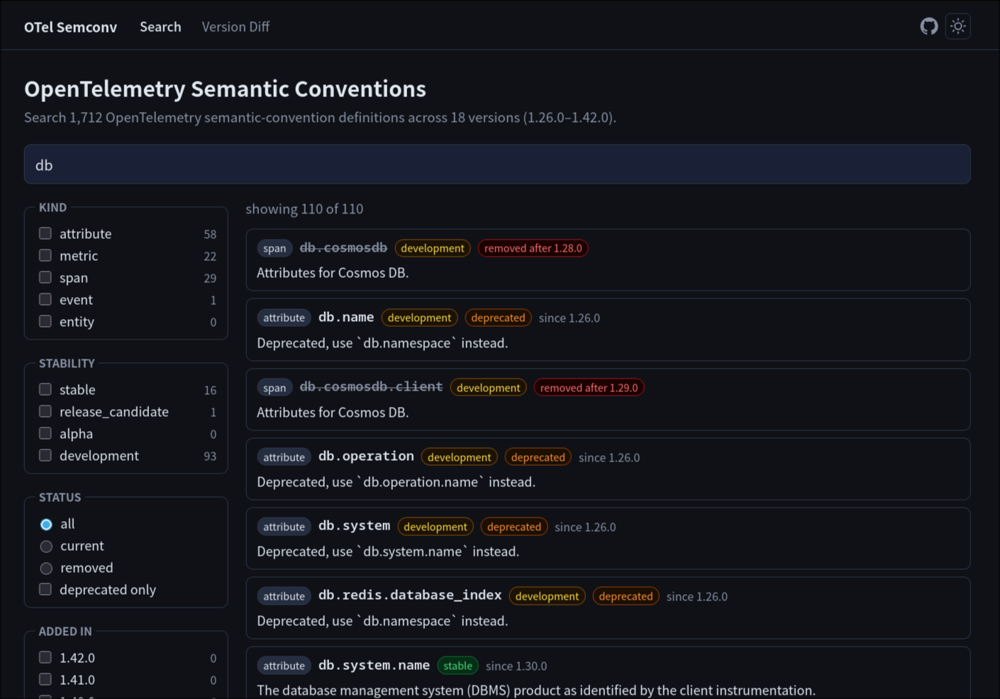
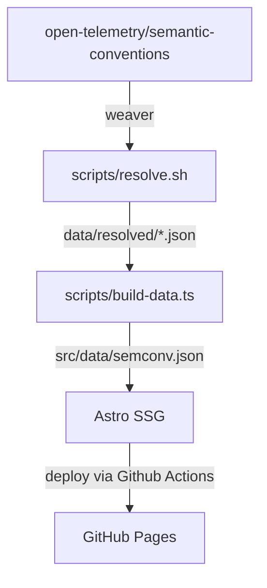

# otel-semconv-search

Fast searchable explorer for [OpenTelemetry semantic conventions](https://opentelemetry.io/docs/specs/semconv/), with per-version history.

Search 1,500+ attribute, metric, event, span, and entity definitions across 18 versions (v1.26.0–v1.42.0). Find when each definition was added, track stability changes, and explore version-to-version diffs.

**[Try it live →](https://ymtdzzz.github.io/otel-semconv-search/)**



## Features

- **Full-text search** across all semantic convention definitions, powered by [Orama](https://orama.com/)
- **Faceted filtering** by stability, kind (attribute / metric / event / span / entity), namespace, added version, status, and deprecation
- **Per-entity history** — view the version timeline for any definition
- **Version diff** — see what was added, removed, renamed, or changed in stability between any two releases
- **Removed definitions** are included in search results with clear labeling
- Responsive layout with light and dark theme support

## Local development

**Prerequisites:** Node.js ≥ 22.12.0, [pnpm](https://pnpm.io/), [Weaver](https://github.com/open-telemetry/weaver) (only for data generation)

```bash
pnpm install
pnpm dev        # start dev server at http://localhost:4321
```

The repository includes the pre-built `src/data/semconv.json`, so Weaver is not required to run or build the site.

### Update the dataset

Run the full data pipeline to pick up new semconv releases:

```bash
pnpm data       # resolve + build dataset (requires weaver binary in PATH)
```

This runs two steps:

1. **`pnpm resolve`** — fetches each semconv release tag and runs `weaver registry generate` to produce `data/resolved/<version>.json` per release. Already-resolved versions are skipped.
2. **`pnpm build:data`** — reads all resolved JSON files and produces `src/data/semconv.json`.

After reviewing the diff, commit `src/data/semconv.json`.

## Architecture



## License

Apache-2.0. The dataset is derived from [open-telemetry/semantic-conventions](https://github.com/open-telemetry/semantic-conventions) (Apache-2.0).
